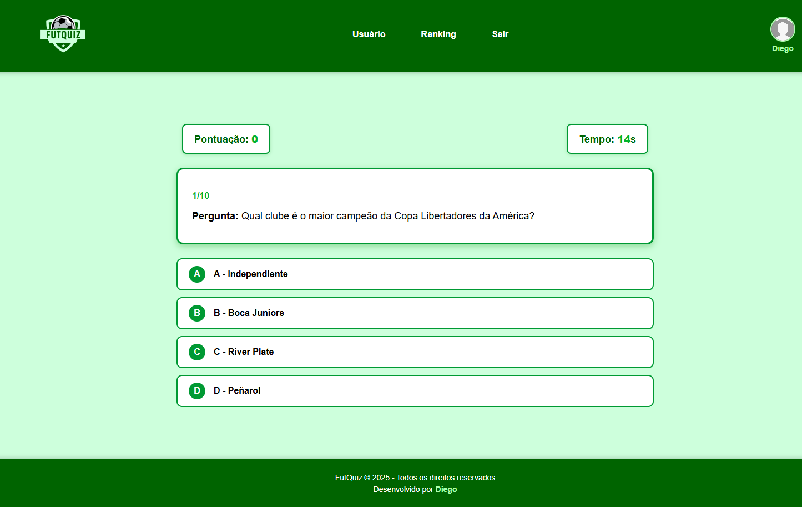

<h1 align="center" style="font-weight: bold;">FutQuiz ⚽🔥</h1>

<div align="center">


</div>

<p align="center">
 <a href="#sobre">Sobre</a> • 
 <a href="#funcionalidades">Funcionalidades</a> • 
 <a href="#tecnologias">Tecnologias</a> • 
 <a href="#como-rodar">Como Rodar</a> • 
 <a href="#estrutura">Estrutura do Projeto</a> •
 <a href="#preview">Preview</a> •
 <a href="#autor">Autor</a>
</p>

<p align="center">
    <b>O FutQuiz é uma aplicação web feita para testar seus conhecimentos de futebol, utilizando PHP, HTML, CSS e JavaScript. Com perguntas dinâmicas, sistema de pontuação e tela de resultados, o projeto simula um quiz real para os amantes do esporte.</b>
    <br><br>
    🔗 <b>LINK ONLINE:</b> https://futquiz.kesug.com
</p>

---

<h2 id="sobre">📋 Sobre o Projeto</h2>

O **FutQuiz** é um quiz interativo com perguntas relacionadas ao mundo do futebol: times, jogadores, história, títulos e curiosidades.  

Este projeto foi criado com o objetivo de praticar:

- Estrutura **MVC simples**  
- Back-end em **PHP nativo**  
- Organização de rotas  
- Separação entre **views**, **controllers** e **lógica**  
- Integração com JavaScript na navegação  
- **Hospedagem gratuita** no InfinityFree  

Além disso, o site foi projetado para ser rápido, intuitivo e responsivo.

---

<h2 id="funcionalidades">🚀 Funcionalidades Principais</h2>

- ⚽ **Perguntas dinâmicas** carregadas via PHP  
- 🧠 **Sistema de pontuação** automático  
- 🔢 **Cálculo de acertos e erros**  
- 🎯 **Tela final com resultado detalhado**  
- ⏭️ **Navegação simples e fluida**  
- 🎨 **Interface responsiva e amigável**  
- 📁 **Código organizado em MVC**

---

<h2 id="tecnologias">💻 Tecnologias Utilizadas</h2>

<div>
  
  <span>PHP 7+</span>
</div>
<div>
  
  <span>JavaScript</span>
</div>
<div>
  
  <span>HTML5</span>
</div>
<div>
  
  <span>CSS3</span>
</div>

---

<h2 id="como-rodar">🚀 Como Rodar o Projeto</h2>

1️⃣ **Clone o repositório**
```bash
git clone https://github.com/Dieegoo13/FutQuiz.git

```

<h2 id="preview">📸 Preview do Projeto</h2> 

